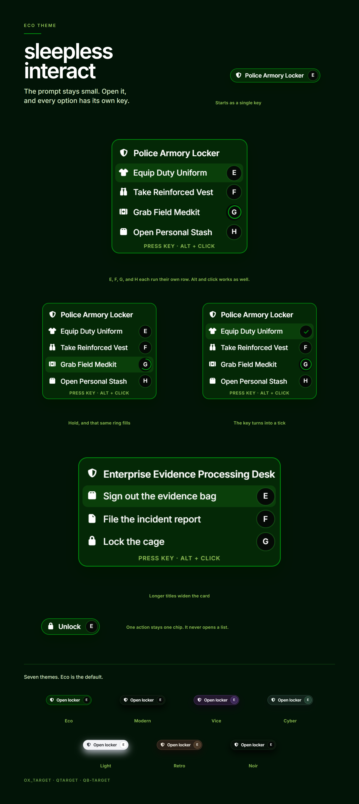

# sleepless_interact

World interactions for FiveM. The targeting is sleepless. The interface was revamped by [zStretz](https://github.com/Stretz).



A target stays a single key until you open it. The list then gives every option its own key, a hold fills that same ring, and a tick confirms the choice. Alt and click works too. Longer titles widen the card instead of getting cut off.

This build keeps the sleepless interaction API and the ox_target, qtarget, and qb-target compatibility. What changed is the prompt you see in the world.

## Interface

- **Compact prompt.** One key and a title until the list is opened.
- **A key per option.** The bound interact key is the first row. The next rows take the following keys, so a list might read E, F, G, H. An option can set its own `key` instead.
- **Keys stay on this menu.** While the list is open, those keys do not fire other binds. Movement is held until the list closes. A single-option prompt does not take the keyboard.
- **Hold.** If an option has `holdTime`, the ring on its key is the progress. Releasing early cancels it.
- **Tick.** A click, a hotkey, or a finished hold replaces that key with a tick, then the menu closes.
- **Alt + click.** Hold the click key (Left Alt by default) to free the cursor and press a row. Right click returns the camera.
- **Width.** The chip and the menu grow with the title and the option labels, and only truncate at the edge of the interaction texture.
- **Themes.** Eco ships as the default: black, white, and a lime accent. Modern, Vice, Cyber, Light, Retro, and Noir are included, along with Legacy, Minimal, Industrial, and Fantasy.

## Requirements

- [ox_lib](https://github.com/overextended/ox_lib)

Framework hooks are included for ox_core, Qbox, QBCore, ESX, and ND.

## Install

1. Put this folder in your server `resources` directory.
2. Start `ox_lib` before it.
3. Do not also start `ox_target`, `qtarget`, or `qb-target`. This resource provides the first two and answers qb-target calls itself.

```cfg
ensure ox_lib
ensure sleepless_interact
```

Set the theme in `client/modules/config.lua`:

```lua
config.theme = 'eco'
```

`config.themeColor` overrides the accent for every theme. Leave it `nil` to use the theme's own color.

Other useful settings in that file:

| Setting | Default | What it does |
| --- | --- | --- |
| `defaultInteractKey` | `E` | Key that opens a compact list and runs the first row |
| `clickKey` | `LMENU` | Hold to click the prompt with the mouse |
| `compactOptions` | `true` | Show one chip until the menu is opened |
| `compactIdleMs` | `2500` | How long a compact menu stays open |
| `requireLookAt` | `true` | The player has to be looking at the target |
| `requireLos` | `true` | Hide targets the player cannot see |
| `duiScale` | `0.2` | Size of the world prompt |

## Usage

The exports are the sleepless ones. A full option reference is in the [original docs](https://sleeplessdevelopment.dev/docs/interact).

```lua
local interact = exports.sleepless_interact

interact:addCoords(vec3(441.2, -982.0, 30.7), {
    {
        label = 'Equip Duty Uniform',
        icon = 'fa-solid fa-shirt',
        menu = 'Police Armory Locker',
        menuIcon = 'fa-solid fa-shield-halved',
        onSelect = function(data)
            print(data.coords)
        end,
    },
    {
        label = 'Grab Field Medkit',
        icon = 'fa-solid fa-kit-medical',
        holdTime = 1500,
        onSelect = function()
            print('held')
        end,
    },
})
```

`menu` and `menuIcon` set the title on the card. Icons are Font Awesome classes.

The same option tables work on coords, models, entities, and the global ped, vehicle, object, and player lists:

- `addCoords` / `removeCoords`
- `addModel` / `removeModel`
- `addEntity` / `removeEntity`
- `addLocalEntity` / `removeLocalEntity`
- `addGlobalPed` / `removeGlobalPed`
- `addGlobalVehicle` / `removeGlobalVehicle`
- `addGlobalObject` / `removeGlobalObject`
- `addGlobalPlayer` / `removeGlobalPlayer`

An option can fire `onSelect`, a client `event`, a `serverEvent`, an `export`, or a `command`. `groups` and `items` hide it from players who should not see it. `canInteract` can hide it from the current moment. `cooldown` blocks the prompt for a few milliseconds after a choice.

Resources written for ox_target or qtarget can keep their calls. qb-target calls are translated to the same options.

## Credits

The interface revamp is by [zStretz](https://github.com/Stretz).

The interaction library is [sleepless_interact](https://github.com/Sleepless-Development/sleepless_interact) by Sleepless Development. A large part of the targeting comes from [ox_target](https://github.com/overextended/ox_target) by Linden, which is what keeps the feature set in line with the original.
